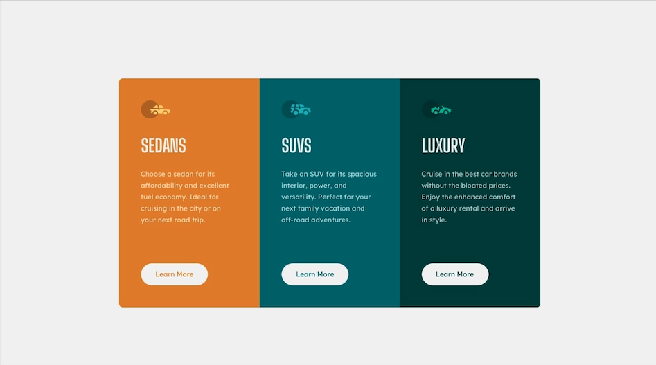

# Frontend Mentor - 3-column preview card component solution

This is a solution to the [3-column preview card component challenge on Frontend Mentor]

Frontend Mentor challenges help you improve your coding skills by building realistic projects. 

## Table of contents

- [Overview](#overview)
  - [The challenge](#the-challenge)
  - [Screenshot](#screenshot)
  - [Links](#links)
- [My process](#my-process)
  - [Built with](#built-with)
  - [What I learned](#what-i-learned)
- [Author](#author)
- [Acknowledgments](#acknowledgments)

**Note: Delete this note and update the table of contents based on what sections you keep.**

## Overview

### The challenge

Users should be able to:

- View the optimal layout depending on their device's screen size
- See hover states for interactive elements

### Screenshot

### Links

- Solution URL: [Add solution URL here](https://your-solution-url.com)
- Live Site URL: [https://almonte914.github.io/3-column-preveiw-component/]

## My process

### Built with

- Semantic HTML5 markup
- CSS custom properties
- Bootstrap card classes and styles

### What I learned

There are always different ways of accomplishing the same goal.

#
## Author

- Website - [Alvin Almonte]
- Frontend Mentor - [@almonte914](https://www.frontendmentor.io/profile/almonte914)

